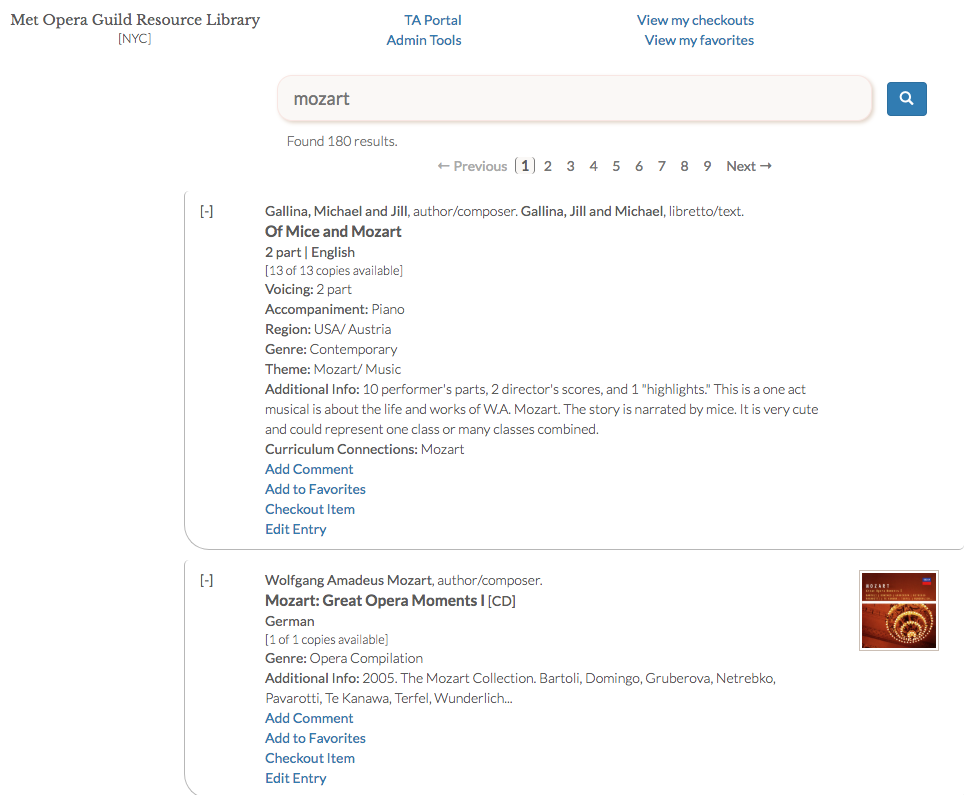
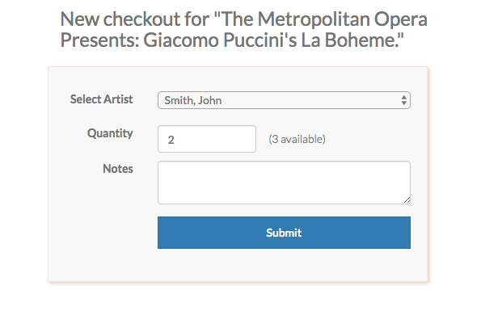
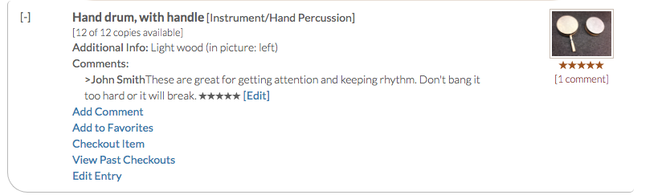
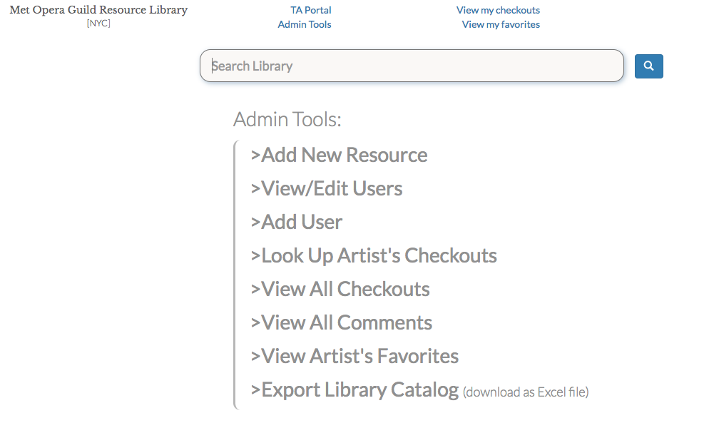

# Met Opera Guild Resource Library
> Live at: https://moglibrary.herokuapp.com/

Ruby on Rails app to manage sheet music, instruments and other educational resources for the [Metropolitan Opera Guild's School Programs Department](https://www.metguild.org/MOG/Opera_in_the_Classroom/Classroom_Landing_Page.html?TM=13). Used by Teaching Artists and administrative staff.

## Usage
#### Search for resources

#### Checkout items

#### Leave comments and ratings for other artists

#### Admin tools

